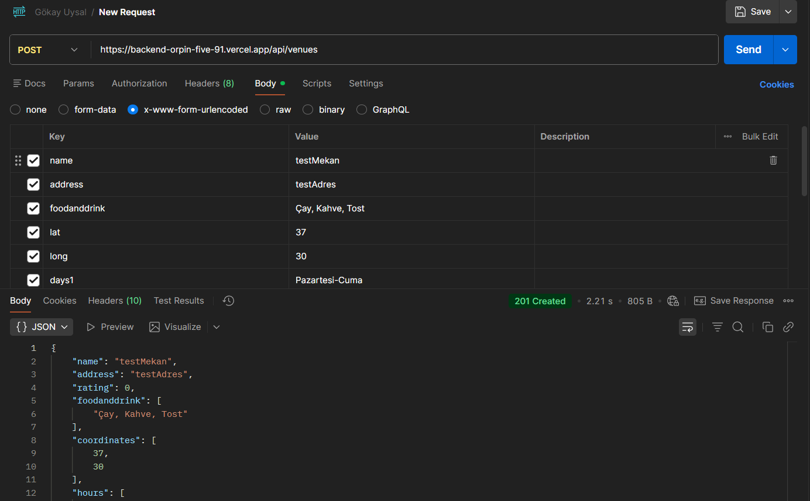
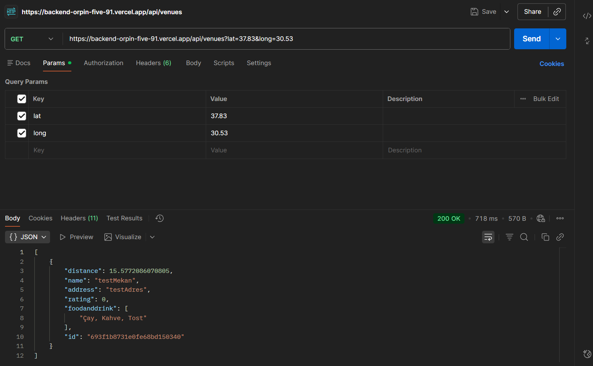
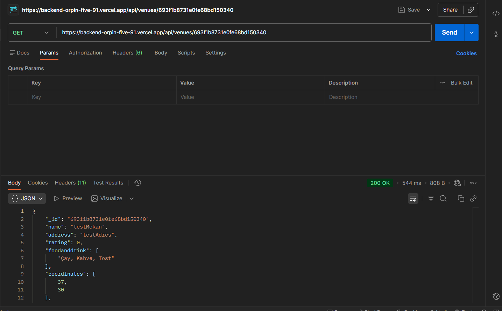
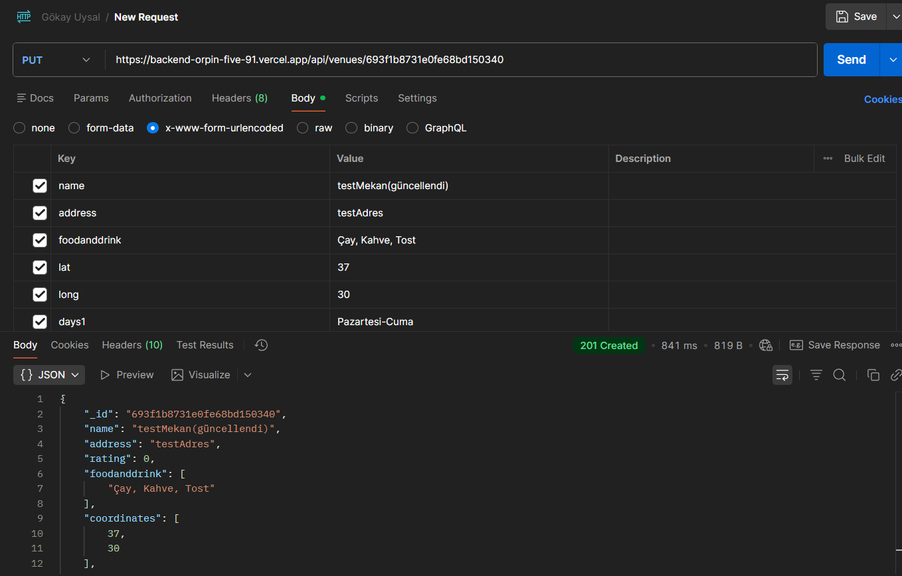
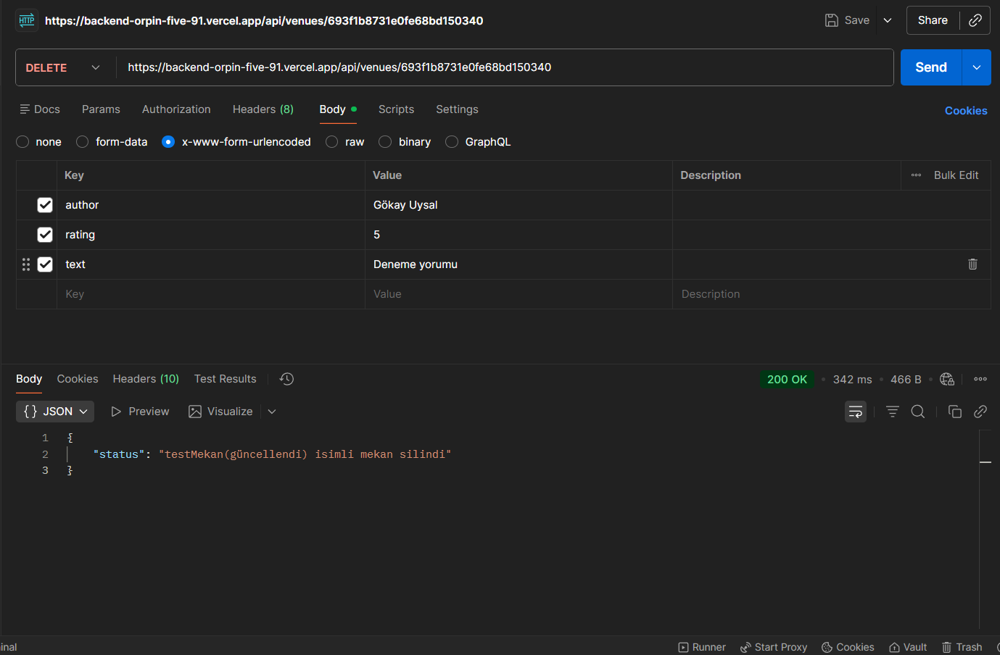
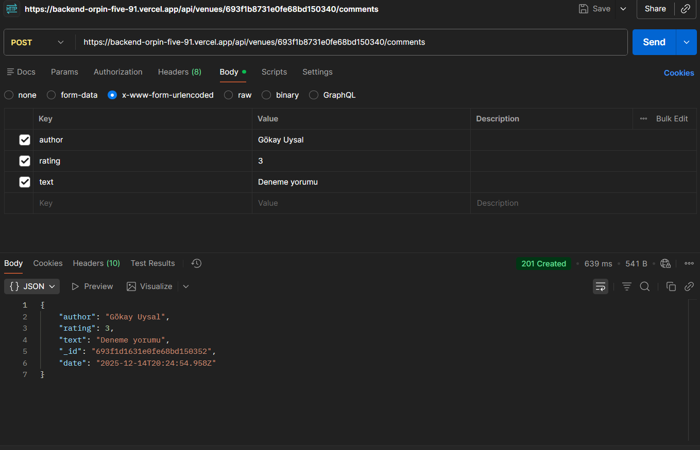
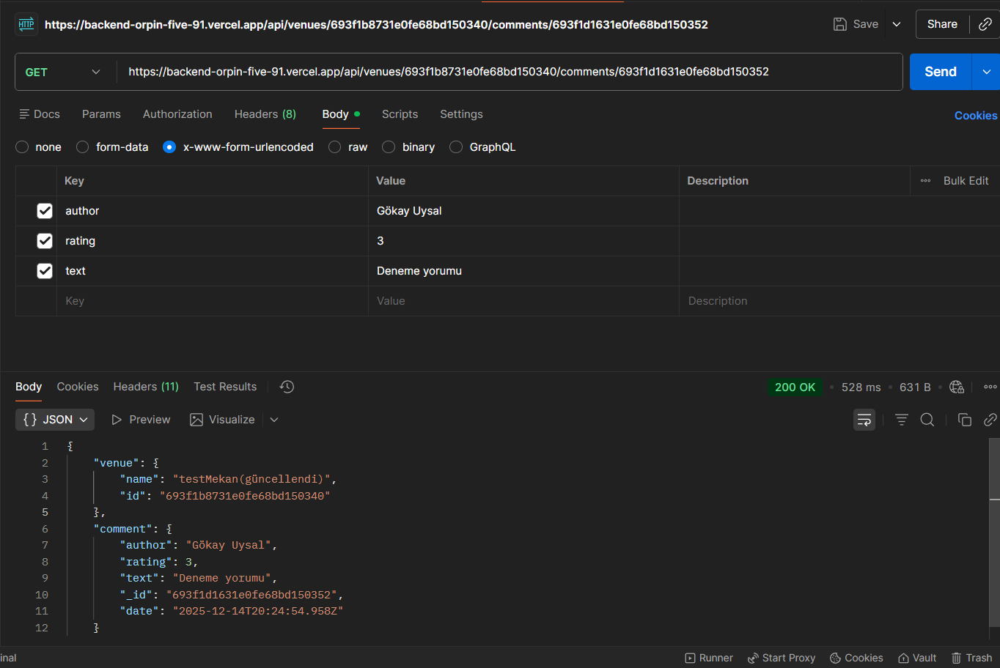
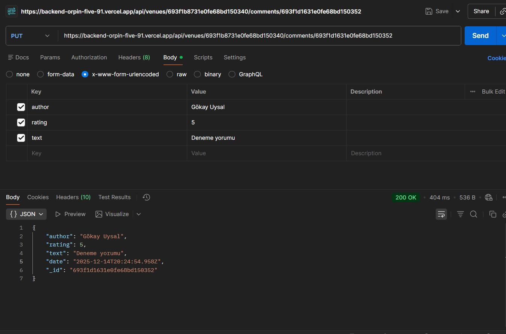
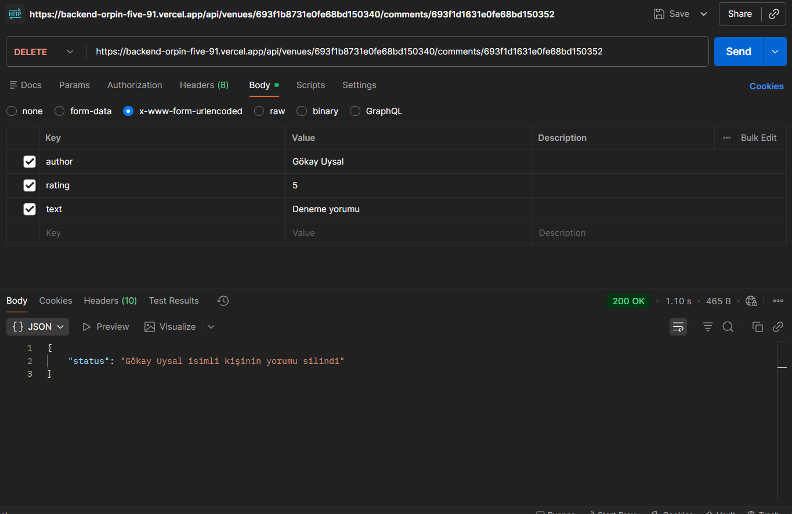

# Mekanbul Backend

Demo: [https://backend-orpin-five-91.vercel.app/]

Bu repo mekanbul-backend uygulamasının basit Node.js + Express + Mongoose backend'idir.

## Kısa Açıklama
* API, mekan (venue) verilerini yönetir: listeleme, ekleme, görüntüleme, güncelleme ve silme.
* MongoDB Cloud kullanır.

## Kurulum
```bash
npm install

## API Test Ekran Görüntüleri (Kanıtlar)

**1. Mekan Ekleme İşlemi (POST)**


**2. Mekanları Listeleme (GET)**


**3. Mekan Getirme (GET)**


**4. Mekan Güncelleme (PUT)**


**5. Mekan Silme (DELETE)**


**6. Yorum Ekleme (POST)**


**7. Yorum Getirme (GET)**


**8. Yorum Güncelleme (PUT)**


**9. Yorum Silme (DELETE)**


